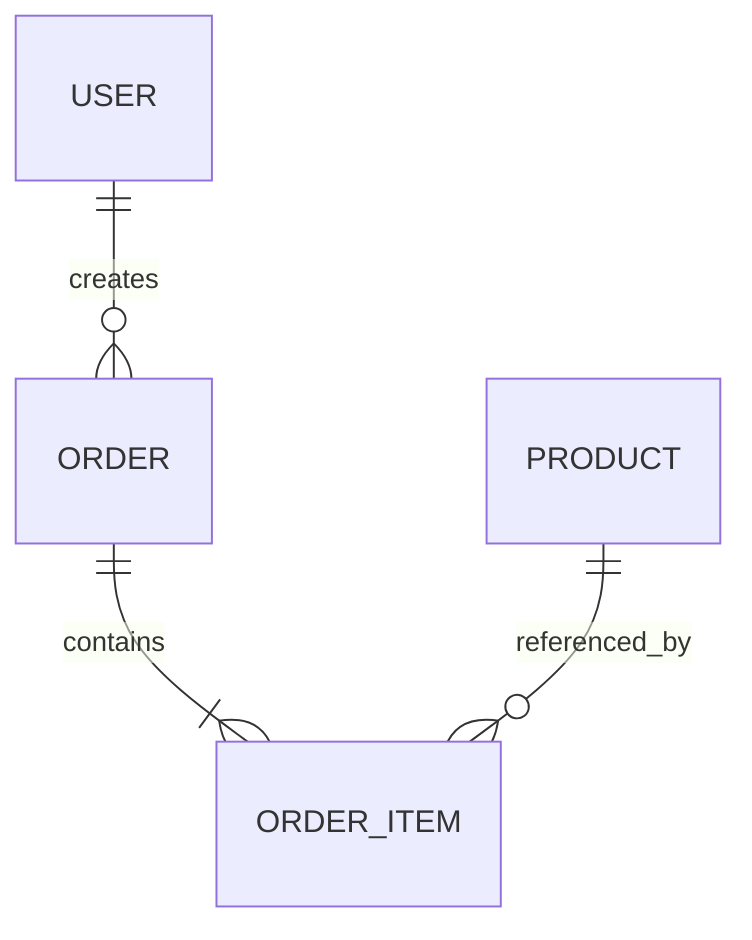
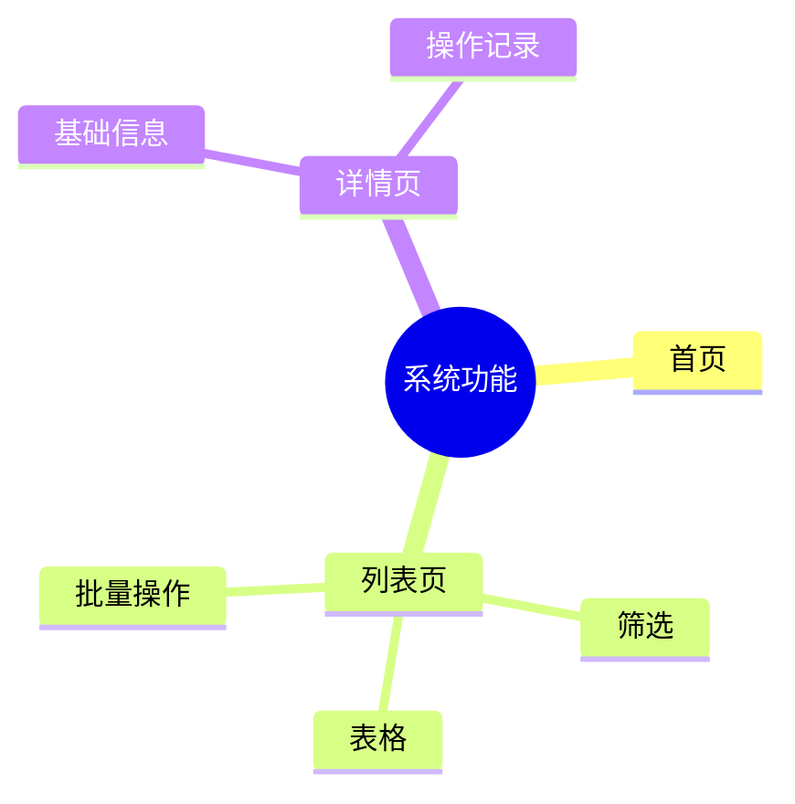
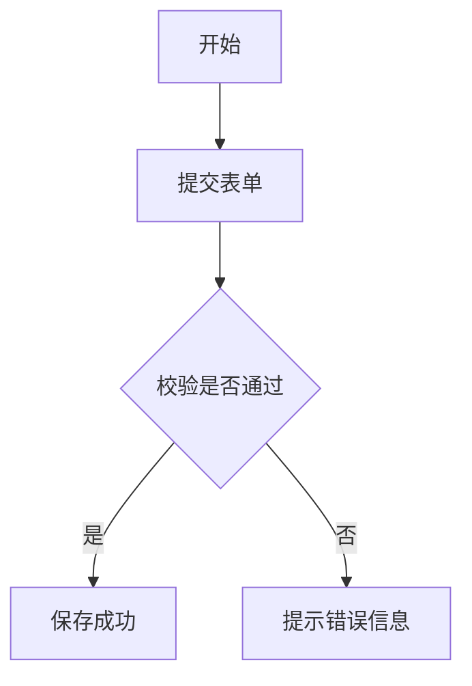
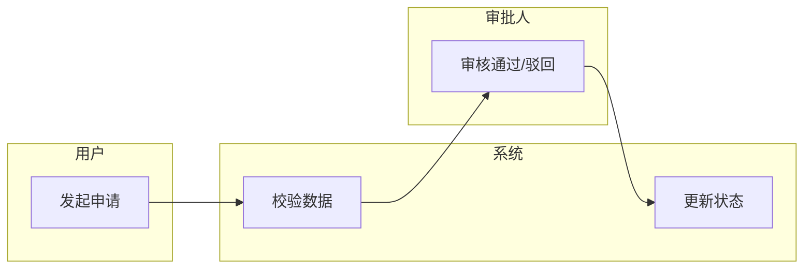

# Mermaid 图表示例

## ER 图

```mermaid
erDiagram
    USER ||--o{ ORDER : creates
    ORDER ||--|{ ORDER_ITEM : contains
    PRODUCT ||--o{ ORDER_ITEM : referenced_by
```

## 信息结构图

```mermaid
mindmap
  root((系统功能))
    首页
    列表页
      筛选
      表格
      批量操作
    详情页
      基础信息
      操作记录
```

## 流程图

```mermaid
flowchart TD
    A[开始] --> B[提交表单]
    B --> C{校验是否通过}
    C -- 是 --> D[保存成功]
    C -- 否 --> E[提示错误信息]
```

## 泳道图

```mermaid
flowchart LR
    subgraph 用户
      A[发起申请]
    end
    subgraph 系统
      B[校验数据]
      C[更新状态]
    end
    subgraph 审批人
      D[审核通过/驳回]
    end
    A --> B --> D --> C
```
