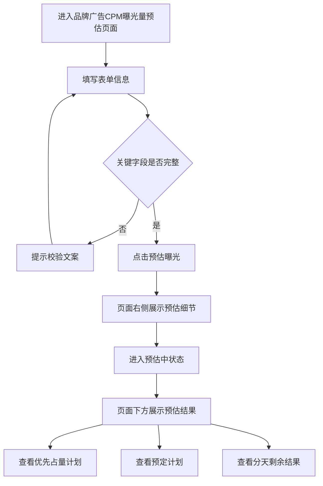
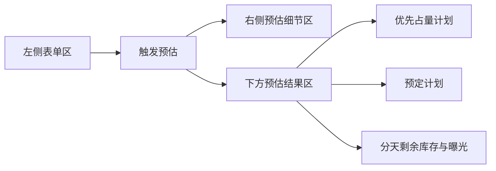
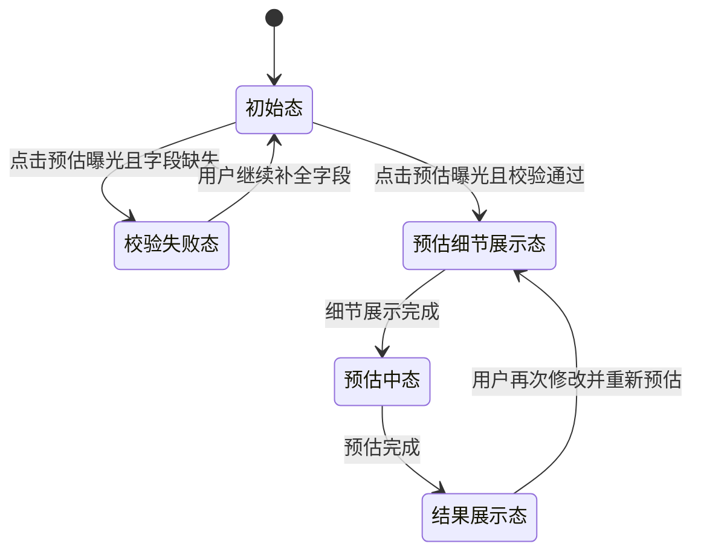

# 品牌广告CPM曝光量预估 PRD

## 关键待确认问题（影响PRD结构）

### 1. 【业务目标】
**当前推测**：该页面用于业务演示和需求评审，优先保证页面清晰、结果可解释、便于截图和汇报。
**可能路径**：
- A：作为演示/评审原型，重点是展示逻辑和页面结构
- B：作为正式运营工具，重点是准确性、权限、留痕和流程联动
**确认结果**：选择 A，当前定位为**演示/评审原型**。

### 2. 【流程分歧】
**当前推测**：用户点击“预估曝光”后，仅需查看预估细节与结果，不涉及后续动作。
**可能路径**：
- A：仅查看结果
- B：支持保存、导出或继续发起投放申请
**确认结果**：选择 A，当前阶段为**仅查看结果**。

### 3. 【系统边界】
**当前推测**：当前页面以单页预估为主，未纳入广告位管理、计划管理、审批等上下游流程。
**可能路径**：
- A：只覆盖单页预估能力
- B：覆盖预估和上下游完整流程
**确认结果**：选择 A，当前 **只覆盖单页预估**。

### 4. 【数据来源】
**当前推测**：当前页面使用内置规则和示例数据模拟预估结果。
**可能路径**：
- A：继续使用规则模拟
- B：接入真实库存与计划数据接口
**确认结果**：选择 A，当前 **继续规则模拟**。

### 5. 【权限模型】
**当前推测**：原型阶段不强调权限隔离，任何评审人员都可查看页面内容。
**可能路径**：
- A：暂不需要权限控制
- B：按角色或部门控制数据和操作
**确认结果**：选择 A，当前 **暂不需要权限控制**。

---

## 1. 需求背景

品牌广告售卖前，运营人员需要快速判断某广告位在指定时间段内的剩余库存情况，并了解交叉计划、优先占量计划、预定计划对库存和曝光的影响。当前该页面作为“品牌广告 CPM 曝光量预估”原型，用于业务评审、产品沟通和页面演示。

本轮需求来自聊天窗口中的连续迭代输入，重点围绕以下方面优化：

- 表单字段和必填规则调整
- 页面交互流程优化
- 预估细节与预估结果的布局重构
- 结果表格字段口径统一
- 结果说明文案改写
- 数值格式标准化

当前阶段目标不是上线正式系统，而是形成一份可演示、可评审、可继续迭代的中后台预估原型。

## 2. 需求目标

### 2.1 产品目标

打造一个结构清晰、口径统一、便于解释的广告库存预估页面，帮助业务人员快速完成以下工作：

- 填写广告位与投放条件
- 查看交叉计划明细
- 查看优先占量计划与预定计划影响
- 理解剩余库存与剩余曝光的关系
- 在业务评审中直接演示和讲解页面逻辑

### 2.2 本期目标

本期 PRD 仅覆盖单页预估能力，重点实现：

- 基础表单录入与校验
- 右侧预估细节展示
- 下方预估结果展示
- 两类计划表与分天结果表展示
- 字段口径和说明文案统一

### 2.3 非目标

本期不包含：

- 真实库存接口接入
- 数据持久化保存
- 导出能力
- 投放申请或审批流转
- 权限分级与操作留痕

## 3. 用户与场景

### 3.1 目标用户

- 广告投放运营
- 广告产品经理
- 销售支持人员
- 参与方案评审的业务同学

### 3.2 核心使用场景

#### 场景 1：业务评审
用户在评审会上填写广告位和时间信息，点击“预估曝光”，现场展示预估细节与预估结果，用于沟通库存可售情况。

#### 场景 2：方案预判
用户在售前或排期前，快速判断某广告位在指定周期内的剩余库存与剩余曝光，辅助判断能否支持新投放。

#### 场景 3：口径解释
用户使用结果区中的说明文案和字段结构，解释“库存”“非CPM库存”“曝光”的计算关系，减少口头说明成本。

## 4. 功能范围

### 4.1 页面整体结构

页面分为三块：

1. **左侧表单区**：填写预估条件
2. **右侧预估细节区**：展示交叉计划明细
3. **下方预估结果区**：展示两类计划结果和分天剩余结果

### 4.2 交互流程

用户流程如下：

1. 填写基础预估信息
2. 点击“预估曝光”
3. 右侧先展示“预估细节”
4. 页面进入短暂预估过程
5. 下方展示“预估结果”

说明：

- “预估细节”应展示在页面右侧，而不是按钮旁边
- “预估结果”展示在按钮下方，并横向铺满
- 两部分展示顺序必须清晰分离

## 5. 详细需求

### 5.1 表单区

#### 5.1.1 输入项

页面需支持以下输入项：

| 模块 | 字段 | 是否必填 | 说明 |
| --- | --- | --- | --- |
| 基础信息 | 预估标题 | 是 | 最长 32 字，显示字数统计 |
| 广告位信息 | 应用 | 是 | 下拉选择 |
| 广告位信息 | 页面 | 是 | 下拉选择 |
| 广告位信息 | 广告位 | 是 | 下拉选择 |
| 广告位信息 | 样式 | 否 | 已改为非必填 |
| 广告位信息 | 子位 | 是 | 数字步进器，范围 1~9 |
| 广告位信息 | 手机平台 | 是 | 多选，默认全选 IOS / Android / 鸿蒙 |
| 广告位信息 | 售卖方式 | 是 | 下拉选择 |
| 广告位信息 | 投放起止时间 | 是 | 时间范围 |
| 广告位信息 | 最小版本 | 否 | 文本输入 |
| 广告位信息 | 最大版本 | 否 | 文本输入 |
| 广告位信息 | 库存曝光转化率 | 是 | 文本输入 |
| 定向信息 | 身份限定 | 否 | 开关 |
| 定向信息 | 年龄限定 | 否 | 开关 |
| 定向信息 | 地区限定 | 否 | 开关 |
| 定向信息 | 人群限定 | 否 | 开关 |
| 投放限制 | 投放限制 | 否 | 开关 |
| 投放限制 | 时间类型 | 否 | 单选 |
| 投放限制 | 单用户总限制 | 否 | 文本输入 |
| 投放限制 | 单用户每周限制 | 否 | 文本输入 |
| 投放限制 | 单用户每日限制 | 否 | 文本输入 |

#### 5.1.2 校验规则

点击“预估曝光”时，以下字段必须完整：

- 预估标题
- 投放起止时间
- 库存曝光转化率
- 手机平台

“样式”字段不参与必填校验。

校验失败时，显示提示：

> 请补全预估标题、库存曝光转化率、手机平台和投放起止时间后再进行预估。

### 5.2 预估细节区

#### 5.2.1 展示位置

- 位于页面右侧
- 在桌面端与左侧表单并排展示
- 高度范围限制在“预估标题”到“预估曝光按钮”之间
- 内容超出时，区域内部滚动

#### 5.2.2 展示时机

- 点击“预估曝光”后立即展示
- 先于预估结果出现

#### 5.2.3 展示内容

标题：`预估细节`

主位置信息：

- 如：`主位置（美柚-首页贴边-子位:1）`

表格字段：

- 交叉计划ID
- 计划信息
- 投放细节
- 状态
- 说明

状态文案示例：

- 交叉占量
- 不占量（预定计划不占量）
- 不交叉（预估开始前完成）

### 5.3 预估结果区

#### 5.3.1 展示位置

- 位于页面下方
- 横向全宽铺满
- 不受右侧预估细节分栏挤压

#### 5.3.2 顶部摘要

结果区顶部展示摘要信息：

- `预估结果（单位：CPM）`
- `剩余曝光总量`
- `初始库存`

说明：

- 独立标题 `预估结果` 已从标题位删除
- “初始库存 / 库存曝光转化率”整段移动到“优先占量计划”标题下方

### 5.4 优先占量计划模块

#### 5.4.1 标题与说明

模块标题：`优先占量计划`

标题后需展示注释 icon，提示文案为：

> 计划id数值越小优先级越高，越先占量

#### 5.4.2 顶部补充说明

模块标题下方展示：

- 初始库存
- 库存曝光转化率

#### 5.4.3 列表字段

表格字段如下：

1. 交叉计划Id
2. 广告主
3. 计划投放类型
4. 计划来源
5. 库存交叉占量（非CPM）
6. 库存交叉占量
7. 曝光交叉占量
8. 投放时间

#### 5.4.4 字段规则

- 计划 ID 按数值升序展示
- 广告主示例展示为 `康臣药业`
- `库存交叉占量（非CPM） = 库存交叉占量 * 1000`
- `曝光交叉占量 = 库存交叉占量 * 库存曝光转化率`
- 所有数值按千分位展示

#### 5.4.5 剩余结果说明

模块下方需展示：

- `剩余曝光：93,915 （剩余库存：105,191 * 0.8928）`

规则：

- 不再展示 `剩余库存(CPM)`
- 直接展示“剩余库存 * 库存曝光转化率”的关系

#### 5.4.6 分天剩余表

字段如下：

1. 日期
2. 剩余库存（非CPM）
3. 剩余库存
4. 剩余曝光（剩余库存 * 库存曝光转化率）

规则：

- `剩余库存（非CPM） = 剩余库存 * 1000`
- 去掉“合计”一行
- 数值统一千分位展示

### 5.5 预定计划模块

#### 5.5.1 标题与说明

模块标题：`预定计划`

标题后同样展示注释 icon，提示文案为：

> 计划id数值越小优先级越高，越先占量

#### 5.5.2 列表字段

表格字段如下：

1. 交叉计划Id
2. 广告主
3. 计划投放类型
4. 库存交叉占量（非CPM）
5. 库存交叉占量
6. 曝光交叉占量
7. 投放时间

#### 5.5.3 字段规则

- 计划 ID 按数值升序展示
- `库存交叉占量（非CPM） = 库存交叉占量 * 1000`
- `曝光交叉占量 = 库存交叉占量 * 库存曝光转化率`
- 数值统一千分位展示

#### 5.5.4 剩余结果说明

展示格式与优先占量计划一致：

- `剩余曝光：xx,xxx （剩余库存：xx,xxx * 0.8928）`

#### 5.5.5 分天剩余表

字段与规则与优先占量计划一致：

- 日期
- 剩余库存（非CPM）
- 剩余库存
- 剩余曝光（剩余库存 * 库存曝光转化率）

### 5.6 文案与字段统一要求

需统一以下口径：

1. `库存曝光转化比` → `库存曝光转化率`
2. 手机平台默认全选
3. 样式为非必填
4. 所有核心数值按千分位展示
5. 说明文案不再展示 `剩余库存(CPM)`

## 6. 业务规则

### 6.1 计算关系

1. `库存交叉占量（非CPM） = 库存交叉占量 * 1000`
2. `剩余库存（非CPM） = 剩余库存 * 1000`
3. `曝光交叉占量 = 库存交叉占量 * 库存曝光转化率`
4. `剩余曝光 = 剩余库存 * 库存曝光转化率`

### 6.2 排序规则

- 优先占量计划与预定计划列表均按计划 ID 数值升序排序

### 6.3 展示规则

- 页面结果展示分两步：先细节，后结果
- 预估细节在右侧
- 预估结果在下方全宽
- 分天结果表不展示合计行

## 7. 异常与边界

### 7.1 表单未填完整

当关键字段为空时：

- 不触发预估结果渲染
- 显示校验提示
- 隐藏预估细节和预估结果

### 7.2 移动端或窄屏场景

【待确认】当前页面主要面向桌面端评审。若后续需要兼容窄屏，应重新定义右侧细节区与结果区的折叠方式。

### 7.3 数据准确性边界

【假设】当前为规则模拟页面，结果用于演示和沟通，不作为正式投放结算依据。

## 8. 技术与实现说明

### 8.1 当前实现方式

- 单文件静态页面
- HTML + CSS + 原生 JavaScript
- 使用内置数据构造交叉计划和结果表格
- 使用延迟模拟预估过程

### 8.2 当前数据来源

当前使用页面内置规则模拟：

- 初始库存固定值
- 交叉计划固定示例数据
- 根据转化率计算曝光结果

### 8.3 后续扩展方向

后续若进入正式化阶段，可扩展：

- 真实库存和计划接口接入
- 结果保存与导出
- 多角色权限控制
- 与广告位、计划、审批流程联动

## 9. 验收标准

### 9.1 表单区验收

- [ ] 样式字段不再有必填星号
- [ ] 样式字段不参与提交校验
- [ ] 手机平台默认全选 IOS / Android / 鸿蒙
- [ ] 校验文案不再包含“样式”

### 9.2 布局验收

- [ ] 点击“预估曝光”后，预估细节展示在页面右侧
- [ ] 预估结果展示在页面下方全宽区域
- [ ] 右侧细节高度不超过“预估标题”到“预估曝光按钮”的范围

### 9.3 结果区验收

- [ ] 优先占量计划和预定计划均展示注释 icon
- [ ] 计划表按 ID 数值升序排序
- [ ] 计划表新增“广告主”列
- [ ] 计划表新增“库存交叉占量（非CPM）”列
- [ ] 分天结果表展示“剩余库存（非CPM）”列
- [ ] 分天结果表不再显示“合计”行

### 9.4 文案验收

- [ ] 页面不再出现“库存曝光转化比”
- [ ] 剩余说明文案改为“剩余库存 * 库存曝光转化率”格式
- [ ] 页面不再展示“剩余库存(CPM)”说明文案

### 9.5 展示规范验收

- [ ] 关键数值按千分位展示
- [ ] `库存交叉占量（非CPM）` 按 `库存交叉占量 * 1000` 展示
- [ ] `剩余库存（非CPM）` 按 `剩余库存 * 1000` 展示

## 10. 版本建议

### V1：原型评审版

包含：

- 当前页面所有已落地能力
- 规则模拟数据
- 页面演示与评审所需说明能力

### V2：产品化版本【待确认】

可扩展：

- 接口化
- 导出能力
- 数据留痕
- 权限控制
- 与上下游系统打通

## 11. 流程图

### 11.1 用户操作流程

### 11.2 页面展示流程

## 12. 状态流转

### 12.1 页面状态定义

| 状态 | 触发条件 | 页面表现 | 备注 |
| --- | --- | --- | --- |
| 初始态 | 用户首次进入页面 | 仅展示表单区 | 预估细节和预估结果默认不展示 |
| 校验失败态 | 点击预估曝光但关键字段缺失 | 显示校验提示 | 预估细节和预估结果隐藏 |
| 预估细节展示态 | 点击预估曝光且校验通过 | 右侧展示预估细节 | 先于结果出现 |
| 预估中态 | 预估细节展示后进入短暂等待 | 右侧细节保留，可带 loading 状态 | 使用模拟等待逻辑 |
| 结果展示态 | 预估完成 | 下方展示预估结果 | 可同时查看细节与结果 |

### 12.2 状态流转图

### 12.3 字段级状态规则

- `样式`：非必填，可为空
- `手机平台`：默认全选，若全部取消选择，则提交时报错
- `库存曝光转化率`：为空时禁止进入预估流程
- `预估标题`：为空时禁止进入预估流程
- `投放起止时间`：任一为空时禁止进入预估流程

## 13. 验收用例

### 13.1 表单与校验用例

| 用例ID | 用例名称 | 前置条件 | 操作步骤 | 预期结果 |
| --- | --- | --- | --- | --- |
| AC-001 | 样式非必填 | 页面已打开 | 不选择样式，填写其余必填项并点击预估曝光 | 可正常进入预估流程 |
| AC-002 | 手机平台默认全选 | 页面已打开 | 观察手机平台默认值 | 默认选中 IOS、Android、鸿蒙 |
| AC-003 | 必填字段缺失校验 | 页面已打开 | 清空预估标题后点击预估曝光 | 显示校验提示，不展示细节和结果 |
| AC-004 | 平台全取消校验 | 页面已打开 | 取消全部手机平台勾选并点击预估曝光 | 显示校验提示，不展示细节和结果 |

### 13.2 交互与布局用例

| 用例ID | 用例名称 | 前置条件 | 操作步骤 | 预期结果 |
| --- | --- | --- | --- | --- |
| AC-005 | 预估细节先展示 | 必填项已填写完整 | 点击预估曝光 | 右侧先展示预估细节 |
| AC-006 | 预估结果后展示 | 必填项已填写完整 | 点击预估曝光并等待预估完成 | 下方展示预估结果 |
| AC-007 | 预估细节位置正确 | 必填项已填写完整 | 点击预估曝光 | 预估细节位于页面右侧 |
| AC-008 | 预估结果铺满展示 | 必填项已填写完整 | 点击预估曝光并查看结果区 | 结果区横向铺满，无明显右侧留白 |

### 13.3 数据展示用例

| 用例ID | 用例名称 | 前置条件 | 操作步骤 | 预期结果 |
| --- | --- | --- | --- | --- |
| AC-009 | 计划ID升序展示 | 已进入结果区 | 查看优先占量计划和预定计划列表 | 计划 ID 按数值升序排列 |
| AC-010 | 广告主列展示 | 已进入结果区 | 查看两类计划表 | 两类表格均展示广告主列 |
| AC-011 | 非CPM库存交叉占量展示 | 已进入结果区 | 查看两类计划表 | `库存交叉占量（非CPM） = 库存交叉占量 * 1000` |
| AC-012 | 非CPM剩余库存展示 | 已进入结果区 | 查看分天剩余结果表 | `剩余库存（非CPM） = 剩余库存 * 1000` |
| AC-013 | 千分位展示 | 已进入结果区 | 查看结果区数值 | 所有关键数值按千分位展示 |

### 13.4 文案与说明用例

| 用例ID | 用例名称 | 前置条件 | 操作步骤 | 预期结果 |
| --- | --- | --- | --- | --- |
| AC-014 | 转化率文案统一 | 页面已打开 | 查看页面全部文案 | 不再出现“库存曝光转化比”，统一为“库存曝光转化率” |
| AC-015 | 剩余说明文案格式 | 已进入结果区 | 查看优先占量计划和预定计划下方说明 | 展示为“剩余库存 * 库存曝光转化率”格式 |
| AC-016 | 去除剩余库存CPM文案 | 已进入结果区 | 查看说明文案 | 不再展示“剩余库存(CPM)” |

### 13.5 表格结构用例

| 用例ID | 用例名称 | 前置条件 | 操作步骤 | 预期结果 |
| --- | --- | --- | --- | --- |
| AC-017 | 去除合计行 | 已进入结果区 | 查看分天剩余结果表 | 表格中不出现“合计”行 |
| AC-018 | 优先占量计划注释icon | 已进入结果区 | 查看优先占量计划标题 | 标题后展示注释 icon，提示优先级说明 |
| AC-019 | 预定计划注释icon | 已进入结果区 | 查看预定计划标题 | 标题后展示注释 icon，提示优先级说明 |
