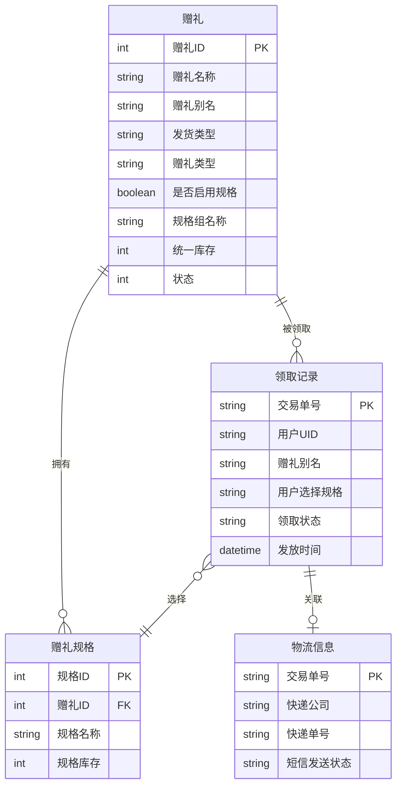
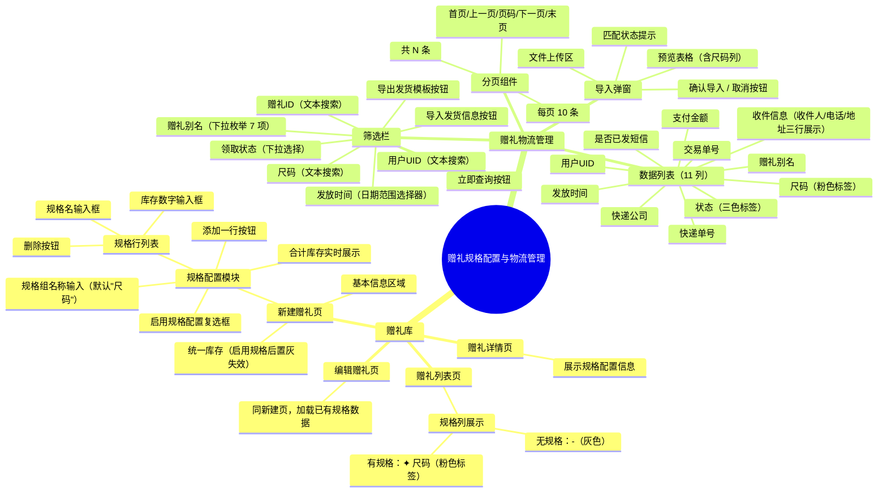
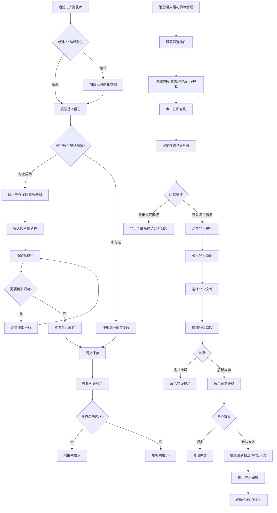

# 运营可以通过赠礼规格配置与物流管理获得实物赠礼全链路管理能力

## 元数据

| 字段 | 内容 |
| --- | --- |
| 状态 | 待评审 |
| 父需求 | 会员福利体系建设 |
| 创建模板 | 中后台需求模版 |
| 分类 | 会员 |
| 业务 | 会员福利 / 赠礼管理 |
| 迭代 | 当前迭代 |
| 处理人 | 待定 |
| 优先级 | High |
| 需求类型 | 基础建设 |
| 需求难度 | B - 现有能力迭代 |
| 技术等级 | P1 |
| 预估工时 | 待评估 |

---

# 一、需求背景

## 1.1 业务大背景

美柚会员体系持续完善，赠礼模块已支持品牌联名实物福利的发放与领取。随着业务场景扩展（如品牌合作赠品包含服装、鞋类等需选尺码的商品），现有赠礼系统缺少**规格/尺码维度**的配置与管理能力，导致运营无法精细化管理实物库存，也无法在物流环节按规格筛选和追踪发货状态。

该需求服务于会员福利方向中"提升实物赠礼运营效率、降低发货差错率、增强库存精细化管理"的目标。

## 1.2 业务子背景

目前已上线功能：
- **赠礼库**：支持新建/编辑/查看赠礼商品，配置基本信息、库存、发货类型等
- **赠礼物流管理**：支持查看用户领取记录、筛选物流状态、导出/导入发货信息

当前存在的痛点：
- 赠礼库不支持按规格（如 S/M/L/XL、36码/37码/38码）管理库存，运营只能填写统一库存数
- 物流管理页面缺少尺码字段，无法按尺码筛选发货记录
- 导出/导入功能不完善，缺少尺码列，发货模板与实际业务脱节
- 实际业务中已出现尺码相关需求（如品牌服装赠品需区分尺码发货）

## 1.3 现状判断及问题

| 现状 | 问题判断 | 历史需求 | 解决方案 |
| --- | --- | --- | --- |
| 赠礼库仅支持统一库存字段，无规格维度 | 实物赠礼（服装/鞋类）无法按尺码管理库存，运营需手动备注尺码，易出错 | 无 | 在赠礼库新建/编辑页增加规格配置模块，支持自定义规格组名和规格行 |
| 赠礼库列表无规格信息展示 | 运营在列表页无法快速识别哪些赠礼已配置规格 | 无 | 列表页增加"规格"列，有规格时展示"✦ 尺码"粉色标签 |
| 物流管理页面无尺码字段 | 运营无法按尺码筛选物流记录，发货时需逐条核对尺码信息 | 无 | 物流列表增加"尺码"列，筛选栏增加尺码搜索框 |
| 导出发货模板缺少尺码列 | 导出的 CSV 模板缺少尺码字段，运营需手动补充，无法直接用于发货 | 无 | 导出 CSV 增加尺码列，包含所有筛选后的全量数据共 13 列 |
| 导入发货信息不支持更新尺码 | 实际发货后如需修正尺码信息，无法通过导入方式批量更新 | 无 | 导入支持更新尺码字段，预览表格展示尺码列 |

---

# 二、项目目标

## 2.1 目标描述

1. **运营可精细化管理实物库存**：赠礼库支持启用规格配置，运营可自定义规格组名称（如"尺码""型号"），按规格粒度管理库存，启用后统一库存自动失效
2. **物流管理支持尺码维度**：物流列表展示尺码字段，支持按尺码筛选，导出/导入均包含尺码信息
3. **提升发货效率与准确性**：通过完善的导出模板和导入能力，运营可批量更新发货信息（含尺码），减少人工逐条操作
4. **降低发货差错率**：尺码信息贯穿配置→领取→物流全链路，减少因尺码信息缺失导致的错发、漏发

## 2.2 迭代节奏

| 阶段 | 内容 | 说明 |
| --- | --- | --- |
| Phase 1 | 赠礼库规格配置 MVP | 新建/编辑页增加规格配置模块：启用开关、规格组名称、动态规格行（名称+库存）、合计库存计算、列表页规格展示 |
| Phase 2 | 物流管理尺码集成 | 物流列表增加尺码列和尺码筛选、导出 CSV 增加尺码字段、导入支持尺码更新与预览 |
| Phase 3 | 领取端规格选择 | 用户在领取页可选择具体规格，选择后扣减对应规格库存（本次不涉及） |

## 2.3 风险预判

| 风险项 | 级别 | 说明 | 应对策略 |
| --- | --- | --- | --- |
| 存量数据兼容 | 中 | 已创建的赠礼商品无规格数据，需兼容空规格展示 | 规格字段默认为空，列表展示"-"，不影响现有功能 |
| 导入格式兼容 | 中 | 旧版导入模板无尺码列，新模板增加尺码列后旧文件可能解析异常 | 导入解析时尺码列设为可选列，缺失时跳过不报错 |
| 规格名称自由输入 | 低 | 运营可能输入不规范名称导致筛选困难 | 提供默认值"尺码"，placeholder 提示示例 |
| 库存一致性 | 高 | 启用规格后统一库存失效，需确保规格库存合计准确 | 前端实时计算合计库存并展示，提交时校验各规格库存之和 |

---

# 三、需求方案

## 3.1 名词定义

| 名词 | 定义 |
| --- | --- |
| 规格配置 | 赠礼商品中用于管理多规格库存的配置模块，包含启用开关、规格组名称、规格行列表 |
| 规格组名称 | 规格维度的名称，默认为"尺码"，运营可自定义（如"型号""规格""颜色"） |
| 规格行 | 单个规格条目，包含规格名（如 S、M、L、36码）和对应库存数量 |
| 统一库存 | 未启用规格配置时的全局库存数量，启用规格后该字段失效 |
| 合计库存 | 所有规格行库存之和，由系统自动计算 |
| 赠礼别名 | 赠礼商品在物流管理中的展示名称，用于快速识别赠礼类型 |
| 发货模板 | 从物流管理页面导出的 CSV 文件，包含全部筛选字段，用于批量填写发货信息后重新导入 |
| 尺码 | 用户领取实物赠礼时选择的规格值，贯穿赠礼配置→领取→物流全链路 |

## 3.2 E-R 图

## 3.3 产品结构图

## 3.4 产品流程图

## 3.5 原型图

原型已实现为可交互 HTML 页面，部署于 GitHub Pages：

<a href="https://zhangjiamin-xiaoyouzi.github.io/subscription-management-v2/" target="_blank">🔗 在线预览 →</a>
<a href="https://github.com/zhangjiamin-xiaoyouzi/subscription-management-v2" target="_blank">📁 zhangjiamin-xiaoyouzi/subscription-management-v2 →</a>

| 页面 | 文件 | 说明 |
| --- | --- | --- |
| 赠礼列表 | gift-list-v2.html | 含规格列展示 |
| 新建赠礼 | gift-create-v2.html | 含规格配置模块 |
| 编辑赠礼 | gift-edit-v2.html | 同新建，支持加载已有数据 |
| 赠礼详情 | gift-detail-v2.html | 规格信息展示 |
| 赠礼物流管理 | gift-logistics-list-v2.html | 含尺码筛选、导出、导入 |

> 所有原型页面包含完整交互逻辑、Mock 数据。

## 3.6 需求说明

### 模块一：赠礼库 — 规格配置（新建/编辑页）

| 功能模块 | 功能点 | 优先级 | 详细说明 |
| --- | --- | --- | --- |
| 规格配置 | 启用开关 | P0 | 复选框形式，label 为"启用规格配置"。默认不勾选。勾选后展示规格配置区域，统一库存字段自动禁用（置灰 + disabled） |
| 规格配置 | 规格组名称 | P0 | 文本输入框，默认值"尺码"，placeholder 为"尺码"。运营可修改为"型号""规格""颜色"等。输入框宽度 120px，与标签同行展示 |
| 规格配置 | 规格行列表 | P0 | 表格形式，列：规格名（文本输入，placeholder "如 S / 36 / 100g"）、库存（数字输入，min=0，placeholder "0"）、操作（删除按钮）。至少保留 1 行，不可全部删除 |
| 规格配置 | 添加规格行 | P0 | "＋ 添加一行"按钮，点击后在列表末尾追加空行（名称和库存均为空） |
| 规格配置 | 删除规格行 | P0 | 每行右侧"删除"按钮，点击删除该行。仅剩 1 行时不显示删除按钮，保证至少 1 个规格 |
| 规格配置 | 合计库存 | P0 | 实时计算所有规格行库存之和，展示在表格下方，格式："合计库存：N"。仅展示不提交，提交时由规格行自身库存提交 |
| 统一库存 | 规格联动禁用 | P0 | 启用规格配置后，统一库存输入框置灰（disabled），不可编辑，背景色变灰。提示文案："启用规格配置后，统一库存不生效，改为按规格管理库存" |
| 数据提交 | 规格数据提交 | P0 | 提交时携带 has_specs（boolean）、spec_group_name（string）、specs（array of {name, stock}）。未启用规格时 specs 为空数组 |

### 模块二：赠礼库 — 列表规格展示

| 功能模块 | 功能点 | 优先级 | 详细说明 |
| --- | --- | --- | --- |
| 列表规格列 | 列标题 | P0 | 列表表头增加"规格"列，宽度 80px |
| 列表规格列 | 有规格展示 | P0 | 当 has_specs === true 时，展示"✦ {spec_group_name}"（如"✦ 尺码"），文字颜色粉色（#ff4d88），字号 12px |
| 列表规格列 | 无规格展示 | P0 | 当 has_specs !== true 时，展示"-"，颜色 #bbb |
| 列表规格列 | 排序筛选 | P2 | 后续版本可增加按"是否有规格"筛选 |

### 模块三：赠礼物流管理 — 筛选栏

| 功能模块 | 功能点 | 优先级 | 详细说明 |
| --- | --- | --- | --- |
| 筛选栏 | 发放时间 | P0 | 两个日期选择器（开始日期、结束日期），中间用"至"分隔。筛选时包含结束日期当天的全部数据 |
| 筛选栏 | 状态筛选 | P0 | 下拉选择框，宽度 100px。选项：全部（空值）、待领取（pending）、已领取（received）、已发货（shipped） |
| 筛选栏 | 赠礼别名 | P0 | 下拉选择框，宽度 160px。枚举 7 个固定选项：`【217】A2大礼包-楚乔`、`【218】618活动`、`【235】3333`、`【236】备注y`、`【237】胎心仪大礼包-ygy`、`【238】灌灌灌灌`、`【243】年卡*胎心仪`。默认选项"赠礼别名"（空值，不筛选） |
| 筛选栏 | 赠礼ID | P2 | 文本输入框，placeholder "赠礼ID"。按交易单号模糊匹配 |
| 筛选栏 | 用户UID | P1 | 文本输入框，placeholder "用户UID"。按 UID 包含匹配 |
| 筛选栏 | 尺码搜索 | P1 | 文本输入框，placeholder "尺码"，宽度 80px。模糊匹配（如输入"S"可匹配"S"和"XL"中含S的记录），大小写不敏感。 |
| 筛选栏 | 立即查询 | P0 | 粉色主按钮，点击后重置分页到第 1 页并触发筛选 |

### 模块四：赠礼物流管理 — 数据列表

| 功能模块 | 功能点 | 优先级 | 详细说明 |
| --- | --- | --- | --- |
| 数据列表 | 11列表头 | P0 | 交易单号(220px)、UID(90px)、支付金额(80px)、赠礼别名(140px)、尺码(70px)、发放时间(150px)、收件信息(180px)、快递公司(100px)、快递单号(110px)、是否已发短信(90px)、状态(80px) |
| 尺码列 | 展示样式 | P0 | 有值时以粉色标签展示（背景 #fff0f6、文字 #ff4d88、字重 500、圆角 3px），无值时展示"-"（灰色 #bbb） |
| 状态列 | 标签样式 | P0 | 3 种状态标签：待领取（橙色底 #fff7e6 橙色字 #fa8c16）、已领取（绿色底 #f6ffed 绿色字 #52c41a）、已发货（蓝色底 #e6f7ff 蓝色字 #1890ff） |
| 收件信息 | 展示格式 | P0 | 三行展示：收件人、收货电话、收件地址。字号 12px，颜色 #666，行高 1.6。空值展示"-" |
| 是否已发短信 | 异常状态 | P1 | 发送失败时红色文字展示"发送失败"，正常为空展示"-" |
| 快递信息 | 空值展示 | P0 | 快递公司和快递单号为空时展示"-" |
| 空数据 | 空状态 | P1 | 无筛选结果时，表格展示一行"暂无数据"，居中灰色文字 |

### 模块五：赠礼物流管理 — 导出发货模板

| 功能模块 | 功能点 | 优先级 | 详细说明 |
| --- | --- | --- | --- |
| 导出按钮 | 位置与样式 | P0 | 筛选栏右侧，"导入发货信息"按钮左侧，默认样式按钮 |
| 导出范围 | 全量筛选数据 | P0 | 导出当前筛选条件下的**全部**数据（不受分页限制），而非仅当前页 |
| 导出列 | 13列完整字段 | P0 | 交易单号、UID、支付金额、赠礼别名、尺码、发放时间、收件人、收货电话、收件地址、快递公司、快递单号、是否已发短信、状态 |
| 导出格式 | CSV with BOM | P0 | UTF-8 编码带 BOM（\uFEFF），确保 Excel 直接打开不乱码。逗号分隔，每个单元格用双引号包裹，内部双引号转义为 "" |
| 导出文件名 | 日期命名 | P0 | 格式：`发货数据_YYYY-MM-DD.csv` |
| 尺码列 | 空值处理 | P0 | 尺码为空时导出空字符串（两个双引号之间为空） |

### 模块六：赠礼物流管理 — 导入发货信息

| 功能模块 | 功能点 | 优先级 | 详细说明 |
| --- | --- | --- | --- |
| 导入入口 | 按钮 | P0 | 粉色主按钮"导入发货信息"，位于筛选栏右侧。旁边有灰色提示文字"*请按照模板填写快递公司/快递单号进行导入" |
| 导入弹窗 | 弹窗样式 | P0 | 居中模态框，宽度 720px，最大高度 80vh 可滚动。包含标题"导入发货信息"、关闭按钮、文件上传区、预览表格、取消/确认导入按钮 |
| 文件上传 | 文件类型 | P0 | 支持 .csv 格式。文件选择后自动解析预览 |
| CSV解析 | 分隔符自适应 | P0 | 支持逗号分隔和 Tab 分隔。自动识别分隔符（检测第一行是否含 \t） |
| CSV解析 | 必要列校验 | P0 | 必须包含列：交易单号、快递公司、快递单号。缺少时显示错误提示 |
| CSV解析 | 尺码列可选 | P1 | 尺码列存在则解析更新，不存在则跳过不报错 |
| CSV解析 | 行校验 | P0 | 交易单号为空的行跳过并报错；快递公司、快递单号、尺码均为空的行跳过并报错 |
| 预览表格 | 列展示 | P0 | #（行号）、交易单号、赠礼别名、尺码、快递公司、快递单号、状态。交易单号过长时省略号截断 + title 悬浮展示完整 |
| 预览表格 | 匹配状态 | P0 | 交易单号在系统中存在 → 绿色"✓ 将更新"；不存在 → 黄色底高亮行 + "⚠ 未匹配" |
| 预览表格 | 尺码展示 | P0 | 尺码列以粉色文字展示，空值展示"-" |
| 确认导入 | 更新逻辑 | P0 | 仅更新匹配成功的记录：更新快递公司、快递单号、尺码（如有），重置短信状态为空，将状态从 pending/received 变更为 shipped |
| 确认导入 | 未匹配处理 | P1 | 未匹配的记录跳过不处理（已在预览中标黄提示） |
| 确认导入 | 结果提示 | P0 | 导入完成后弹窗提示"导入完成！共更新 N 条记录"，关闭导入弹窗，清空文件选择，刷新列表回到第 1 页 |
| 按钮状态 | 禁用逻辑 | P1 | 预览表格为空时"确认导入"按钮置灰不可点击 |

### 模块七：分页

| 功能模块 | 功能点 | 优先级 | 详细说明 |
| --- | --- | --- | --- |
| 分页组件 | 页码按钮 | P0 | 首页、上一页、页码列表、下一页、末页。当前页高亮（粉色背景白色字） |
| 分页组件 | 页码计算 | P0 | 每页 10 条。页码列表最多展示 5 个（当前页居中）。总页数 ≤ 1 时隐藏分页 |
| 分页组件 | 总数展示 | P0 | 末尾展示"共 N 条" |
| 分页组件 | 筛选重置 | P0 | 任何筛选条件变更（点击"立即查询"）时自动回到第 1 页 |

---

## 3.7 协同方需求

| 协同方 | 配合内容 | 备注 |
| --- | --- | --- |
| 后端开发 | ① 赠礼表增加 has_specs、spec_group_name 字段，新建 gift_specs 表；② 物流记录表增加 spec 字段；③ 导入接口支持批量更新尺码字段 | 需提供接口文档 |
| 前端（领取端） | 后续需在用户领取页增加规格选择交互，选择后扣减对应规格库存 | Phase 3 迭代 |
| 运营 | ① 确认赠礼别名枚举值是否需要动态获取；② 确认尺码搜索为模糊匹配；③ 提供完整尺码枚举列表 | 当前为模糊匹配 |
| 测试 | ① 验证规格配置启用/禁用的联动逻辑；② 验证导入 CSV 各种异常格式的容错；③ 验证导出 CSV 的 BOM 编码和 Excel 兼容性 | 需覆盖边界用例 |
