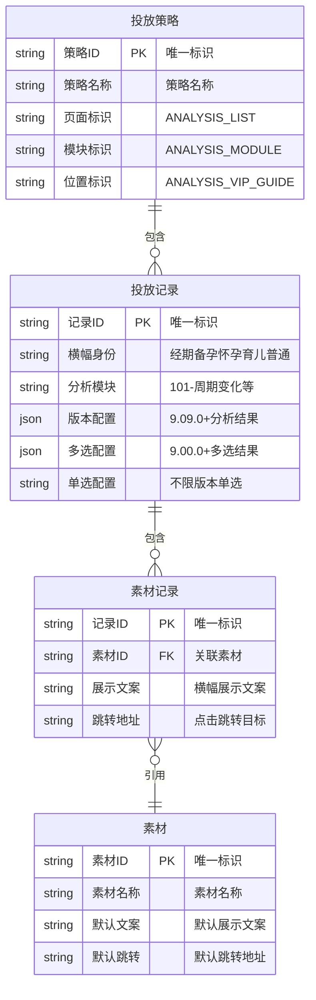
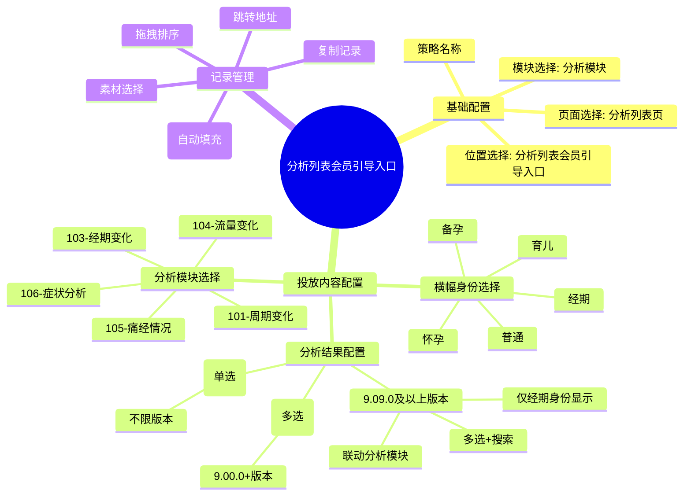
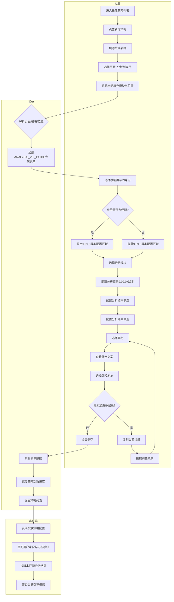

# 运营可通过配置分析列表会员引导入口提升会员转化

## 元数据
- 状态：开发中
- 父需求：无
- 分类：会员
- 业务：订阅管理
- 迭代：9.09.0
- 处理人：张三
- 优先级：High
- 需求类型：新功能
- 需求难度：B
- 技术等级：中
- 预估工时：5人天

---

## 一、需求背景

### 1.1 业务大背景
美柚App的分析模块（周期变化、经期变化、流量变化、痛经情况、症状分析等）是用户高频使用的核心功能。大量非会员用户在此模块查看基础分析结果，但对更深度的分析内容（如近半年趋势对比、异常预警等）有潜在需求。当前分析列表页缺乏系统化的会员转化入口，导致会员开卡转化率偏低。

### 1.2 业务子背景
订阅管理系统已具备"投放策略"配置能力，覆盖支付转化页、会员中心页、我tab页等多个页面/模块的运营位。分析列表页作为新增投放页面，需要提供灵活可配的会员引导入口，帮助运营根据用户身份和分析模块精准投放会员引导内容。

### 1.3 现状判断及问题
| 现状 | 问题判断 | 历史需求 | 解决方案 |
| --- | --- | --- | --- |
| 分析列表页无会员引导入口 | 非会员用户查看分析结果后无转化路径，流失率高 | 无 | 新增"分析列表会员引导入口"投放位，支持运营灵活配置 |
| 现有投放策略不支持按用户身份区分 | 经期/备孕/怀孕/育儿用户需求不同，统一投放转化率低 | 无 | 支持按"横幅身份"维度选择展示范围 |
| 分析模块各自的分析结论类型不同 | 周期变化和痛经情况的结果差异大，需要不同引导文案 | 无 | 根据分析模块联动展示对应的分析结果选项 |
| 9.09.0版本重构了分析结论体系 | 新旧版本分析结果数据结构不同，需区分版本配置 | 无 | 单独提供"9.09.0及以上版本配置"字段，与老版本配置隔离 |

---

## 二、项目目标

### 2.1 目标描述
在订阅管理后台的投放策略模块中，为分析列表页新增"分析列表会员引导入口"运营位配置能力。运营可根据**用户身份**（经期/备孕/怀孕/育儿/普通）和**分析模块**（周期变化/经期变化/流量变化/痛经情况/症状分析），灵活配置多条会员引导记录，实现精准的会员转化引导。

**核心价值：**
- 运营可灵活配置 ≥5 种分析模块的会员引导
- 支持区分 9.09.0 版本前后的分析结果配置，降低版本兼容风险
- 单策略支持多条记录的复制和拖拽排序，提升运营效率

### 2.2 迭代节奏（非必填）
- **一期（9.09.0）**：完成基础配置能力——身份选择、分析模块选择、分析结果配置（含版本区分）、素材选择、跳转地址配置、记录复制排序
- **二期（待定）**：A/B 测试能力、点击率数据看板、AI 推荐配置

### 2.3 风险预判（非必填）
| 风险 | 影响 | 应对措施 |
| --- | --- | --- |
| 分析模块 ID 映射关系变更 | 配置失效、前端展示异常 | 与客户端开发确认模块 ID 映射表，预留兼容逻辑 |
| 9.09.0 版本分析结论体系不稳定 | 配置项需频繁调整 | 9.09.0 版本配置单独隔离，不影响老版本 |
| 身份维度与分析模块交叉组合过多 | 运营配置复杂度高 | 一期仅支持"经期"身份显示 9.09.0 版本配置，二期扩展 |

---

## 三、需求方案

### 3.1 名词定义（非必填）
| 名词 | 定义 |
| --- | --- |
| 投放策略 | 订阅管理后台中用于管理各页面/模块运营位配置的功能模块 |
| 分析列表页 | 美柚App中展示用户分析记录列表的页面 |
| 分析模块 | 分析列表中的具体分析类型：周期变化(101)、经期变化(103)、流量变化(104)、痛经情况(105)、症状分析(106) |
| 会员引导入口 | 在分析模块中展示的会员引导横幅，引导非会员用户开通会员 |
| 横幅身份 | 选择该会员引导横幅面向的用户身份类型：经期/备孕/怀孕/育儿/普通 |
| 分析结果 | 用户完成分析后得出的结论标签，如"周期变长""痛经加重"等，用于匹配展示条件 |
| 9.09.0版本配置 | 针对 9.09.0 及以上客户端版本的分析结果配置，使用新的分析结论 ID 体系（201/202/203系列） |
| 素材 | 会员引导横幅的视觉素材，包含展示文案和跳转地址的预设模板 |

### 3.2 E-R 图（非必填）

### 3.3 产品结构图（10%）

### 3.4 产品流程图（泳道图）（10%）

### 3.5 原型图（非必填）
原型图参见 `订阅后台/recreated-page/rights-pay-create.html` 中 ANALYSIS_VIP_GUIDE 路径对应的表单页面。

### 3.6 需求说明（60%）
| 功能模块 | 功能点 | 优先级 | 详细说明 |
| --- | --- | --- | --- |
| 页面路由 | 分析列表会员引导入口 | P0 | 在投放策略创建/编辑页，选择"分析列表页"→"分析模块"→"分析列表会员引导入口"，展示 ANALYSIS_VIP_GUIDE 专属配置表单 |
| 基础配置 | 横幅身份选择 | P0 | 下拉单选：经期/备孕/怀孕/育儿/普通。默认"请选择"。选择后控制 9.09.0 版本配置区域显隐 |
| 基础配置 | 分析模块选择 | P0 | 下拉单选：101-周期变化/103-经期变化/104-流量变化/105-痛经情况/106-症状分析。选择后联动分析结果选项 |
| 分析结果配置 | 9.09.0及以上版本配置 | P0 | 仅当横幅身份=经期时显示。根据分析模块联动展示对应分析结果选项组（按模块分组）。支持多选+标签展示+搜索过滤。禁用态（未选分析模块时） |
| 分析结果配置 | 分析模块联动规则 | P0 | 周期变化→周期变长/周期变短/周期不规律；经期变化→经期延长/经期缩短；流量变化→流量增多/流量减少；痛经情况→痛经加重/痛经减轻/无痛经；症状分析→症状加重/症状减轻/无症状 |
| 分析结果配置 | 分析结果(多选) | P1 | 9.00.0 及以上版本支持。多选+标签展示+搜索过滤。与单选互斥 |
| 分析结果配置 | 分析结果(单选) | P1 | 不限版本。单选下拉。与多选互斥 |
| 记录管理 | 素材选择 | P0 | 下拉选择已有素材模板，附带"管理素材"外部链接和"刷新"按钮 |
| 记录管理 | 展示文案 | P1 | 根据所选素材自动填充文案，只读展示 |
| 记录管理 | 跳转地址 | P0 | 下拉选择：会员中心页/会员权益页/记录tab活动页/H5链接 |
| 记录管理 | 复制记录 | P1 | 复制当前记录（含素材/文案/跳转）到列表末尾 |
| 记录管理 | 拖拽排序 | P1 | 右侧"投放内容目录"区域支持拖拽排序，调整多条记录的展示顺序 |
| 需求标注 | 字段需求说明 | P1 | "分析结果(9.09.0及以上版本配置)"字段旁提供橙色"需求说明"按钮，点击后弹出模态框展示5条规则说明 |

### 3.7 协同方需求（非必填）
| 协同方 | 配合内容 | 备注 |
| --- | --- | --- |
| 客户端(iOS/Android) | 实现分析列表页会员引导入口的渲染逻辑；支持按身份+分析模块+分析结果匹配规则筛选展示；区分 9.09.0 前后版本的分析结果匹配逻辑 | 需对齐分析模块 ID 映射表和分析结果枚举值 |
| 服务端 | 新增 ANALYSIS_VIP_GUIDE 投放位数据结构；策略保存/查询接口适配新字段；素材库维护 | 字段需支持 identityMode、analysisModule、analysisResultLatest/Multi/Single |
| 数据分析 | 后续迭代提供会员引导入口的曝光/点击/转化数据埋点 | 二期需求 |
| 素材设计 | 提供各身份+分析模块的会员引导横幅素材模板 | 至少覆盖经期 5 个分析模块 |

---

## 附录

### 分析模块枚举表

| 模块ID | 模块名称 | 说明 |
| --- | --- | --- |
| 101 | 周期变化 | 分析用户的月经周期规律性 |
| 103 | 经期变化 | 分析用户的经期天数变化 |
| 104 | 流量变化 | 分析用户的经期流量变化 |
| 105 | 痛经情况 | 分析用户的痛经程度变化 |
| 106 | 症状分析 | 分析用户的经期/非经期症状 |

### 身份枚举表

| 身份 | 说明 |
| --- | --- |
| 经期 | 处于经期记录阶段的用户 |
| 备孕 | 处于备孕阶段的用户 |
| 怀孕 | 处于怀孕阶段的用户 |
| 育儿 | 处于育儿阶段的用户 |
| 普通 | 未选择特定身份的兜底用户 |

### 跳转地址枚举表

| 跳转地址 | 说明 |
| --- | --- |
| 会员中心页 | 美柚App会员中心主页 |
| 会员权益页 | 会员权益说明页 |
| 记录tab活动页 | 记录tab下的活动页面 |
| H5链接 | 自定义H5页面链接 |
