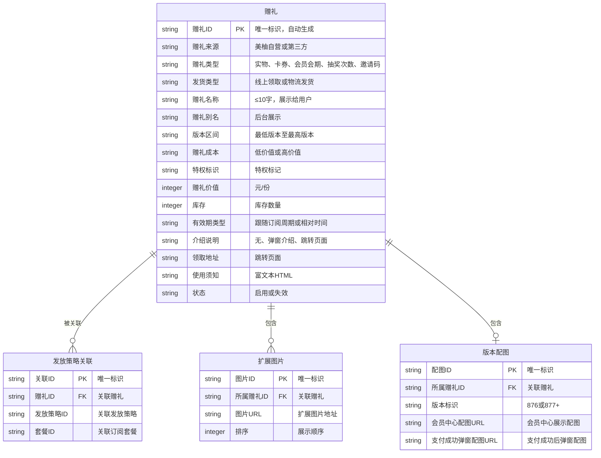
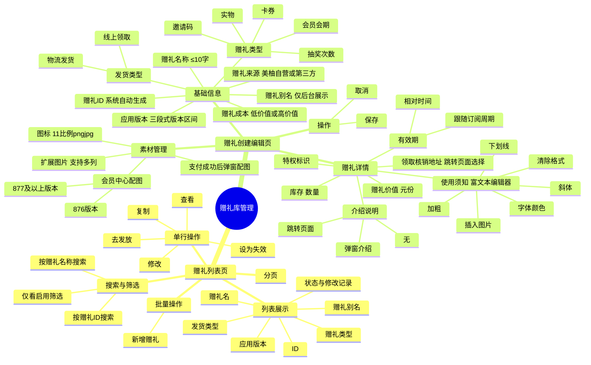
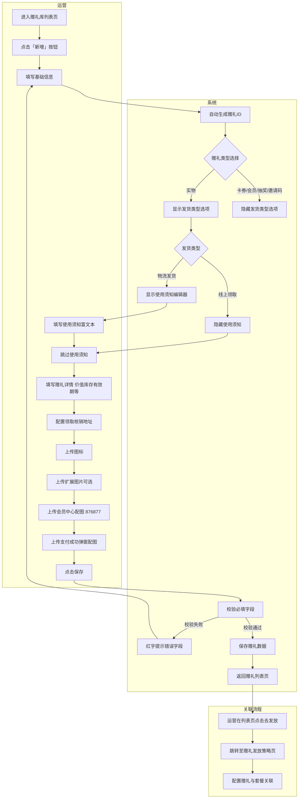

# 运营可通过赠礼库管理赠礼的创建、编辑与发放，提升订阅会员转化

## 元数据
- 状态：开发中
- 父需求：无
- 分类：会员
- 业务：订阅管理
- 迭代：9.10.0
- 处理人：张三
- 优先级：High
- 需求类型：基础建设
- 需求难度：B
- 技术等级：中
- 预估工时：8人天

---

## 一、需求背景

### 1.1 业务大背景
美柚订阅会员业务的核心转化路径依赖于有吸引力的赠礼权益。赠礼作为开卡/续费的核心钩子，直接影响订阅转化率。当前赠礼库管理分散——部分通过硬编码配置、部分通过数据库直操，缺少统一的后台管理入口，运营无法自主完成赠礼的全生命周期管理（创建→编辑→上架→发放→失效）。

### 1.2 业务子背景
订阅管理系统已具备"产品管理→赠礼库"的导航入口。现有赠礼类型涵盖实物、卡券、会员会期、抽奖次数、邀请码等多种形态，但新增赠礼需开发介入修改代码或数据库，运营无法自助完成。赠礼与发放策略（赠礼发放策略）、促销策略（限时促销策略）存在上下游联动关系——赠礼创建后需通过发放策略配置到具体的订阅套餐中。

### 1.3 现状判断及问题
| 现状 | 问题判断 | 历史需求 | 解决方案 |
| --- | --- | --- | --- |
| 赠礼创建依赖开发介入 | 运营无法自助创建赠礼，新增赠礼周期长（≥2天），影响活动上线速度 | 无 | 提供可视化的赠礼创建/编辑页面，运营可自助完成 |
| 赠礼库无统一列表管理 | 运营无法查看全量赠礼状态，赠礼是否启用、由谁修改等信息不透明 | 无 | 提供赠礼库列表页，支持搜索、筛选、分页浏览 |
| 赠礼类型多、字段差异大 | 实物/卡券/会员会期/抽奖次数/邀请码等字段需求不同，缺乏统一配置入口 | 无 | 抽象统一的赠礼配置表单，通过类型选择联动展示差异化字段 |
| 赠礼与发放策略割裂 | 创建赠礼后需到赠礼发放策略模块重新配置关联关系，流程断裂 | 无 | 列表页提供"去发放"快捷入口，一键跳转至发放策略 |
| 实物赠礼缺少使用须知 | 物流发货的实物奖品缺少使用说明，用户领取后不知如何使用 | 无 | 新增"使用须知"富文本字段，支持图文混排编辑 |
| 素材适配多版本、多场景 | 不同客户端版本（876/877）需要不同配图，多场景（图标/弹窗/会员中心）需要不同尺寸素材 | 无 | 提供版本区分图片上传和多场景配图支持 |

---

## 二、项目目标

### 2.1 目标描述
在订阅管理后台的"产品管理→赠礼库"模块中，构建完整的赠礼全生命周期管理能力，包含**赠礼列表**（搜索/筛选/分页）和**赠礼创建/编辑**（6大赠礼类型、3组素材配置）两大核心页面。

**核心价值：**
- 运营可自助完成赠礼的创建、编辑、复制、失效，无需开发介入
- 支持 5 种赠礼类型（实物/卡券/会员会期/抽奖次数/邀请码）的统一管理和差异化配置
- 支持多版本（876/877+）配图和 3 种场景（图标/弹窗/会员中心）素材上传
- 新增实物赠礼"使用须知"富文本编辑，完善用户端体验
- 赠礼列表提供"去发放"快捷入口，打通赠礼→发放策略的流程

### 2.2 迭代节奏（非必填）
- **一期（9.10.0）**：完成赠礼列表页、赠礼创建/编辑页、复制赠礼、赠礼失效、使用须知富文本编辑器
- **二期（待定）**：赠礼版本历史、批量导入/导出、赠礼效果数据看板（发放量/领取量/转化率）

### 2.3 风险预判（非必填）
| 风险 | 影响 | 应对措施 |
| --- | --- | --- |
| 赠礼类型扩展导致表单复杂度增加 | 后续新增赠礼类型需改动前端表单和后端字段 | 表单设计采用类型联动展示，预留扩展接口 |
| 素材图片存储和CDN | 图片未上传或上传失败影响客户端展示 | 前端上传校验（尺寸/格式），后端CDN异步上传 |
| 赠礼发放策略关联耦合 | 赠礼失效后发放策略中引用的赠礼失效未同步 | 赠礼失效时联动检查发放策略引用，给出提示 |
| 低版本兼容性（876 vs 877+） | 不同版本图片配置遗漏导致低版本展示异常 | 表单明确标注版本范围，低版本必填提示 |

---

## 三、需求方案

### 3.1 名词定义（非必填）
| 名词 | 定义 |
| --- | --- |
| 赠礼 | 订阅会员开卡/续费时可获得的附加权益，包含实物、卡券、会员会期、抽奖次数、邀请码等多种类型 |
| 赠礼库 | 订阅管理后台中管理所有赠礼的模块，位于"产品管理"菜单下 |
| 赠礼来源 | 赠礼提供方：美柚自营或第三方商户 |
| 赠礼类型 | 赠礼的形态分类：实物/卡券/会员会期/抽奖次数/邀请码/生活特权 |
| 发货类型 | 线上领取（无需物流）或物流发货（需填写收货地址） |
| 赠礼价值 | 赠礼的市场参考价值，用于计算"节省N元"展示给用户 |
| 赠礼成本 | 运营标记的赠礼成本等级：低价值或高价值。高价值赠礼在退款时需二次核实 |
| 相对时间 | 有效期类型之一，以用户开卡时间为基准的相对天数，如"开卡后30天内有效" |
| 使用须知 | 仅实物赠礼配置的富文本说明，用户在领取页可查看，支持图文混排 |
| 发放策略 | 运营工具模块中的"赠礼发放策略"，将赠礼关联到具体订阅套餐中以触发发放 |
| 展示文案 | 从素材中自动预填充的文案，用于会员引导横幅展示 |
| 876版本配图 | 针对客户端 8.7.6 及以下版本的会员中心配图（因低版本UI不同需要单独的图片） |
| 877及以上版本配图 | 针对客户端 8.7.7 及以上版本的会员中心配图 |

### 3.2 E-R 图（非必填）

### 3.3 产品结构图（10%）

### 3.4 产品流程图（泳道图）（10%）

### 3.5 原型图（非必填）
- <a href="file:///C:/Users/MeetYou/vscode-workspace/%E8%AE%A2%E9%98%85%E5%90%8E%E5%8F%B0/recreated-page/gift-list.html" target="_blank">🔗 赠礼列表页原型 →</a>
- <a href="file:///C:/Users/MeetYou/vscode-workspace/%E8%AE%A2%E9%98%85%E5%90%8E%E5%8F%B0/recreated-page/gift-create.html" target="_blank">🔗 赠礼创建/编辑页原型 →</a>

### 3.6 需求说明

| 功能模块 | 功能点 | 优先级 | 详细说明 |
| --- | --- | --- | --- |
| **赠礼列表页** | 列表展示 | P0 | 以表格形式展示所有赠礼，列包括：赠礼名、赠礼别名、ID、发货类型（带标签样式，线上领取蓝色标签）、赠礼类型（按类型不同颜色标签：实物橙色、抽奖蓝色、会员绿色、邀请码粉红、特权紫色）、应用版本（默认"~"表示全版本）、状态（启用绿色/失效灰色及最后修改人与时间）、操作 |
| **赠礼列表页** | 搜索与筛选 | P0 | 支持按赠礼ID（精确匹配）和赠礼名称（模糊搜索）组合搜索；提供"仅看启用"checkbox，默认勾选，取消后显示包含失效赠礼的全部数据 |
| **赠礼列表页** | 新增赠礼 | P0 | 顶部"＋ 新增"按钮跳转至赠礼创建页 |
| **赠礼列表页** | 修改 | P0 | 每行"修改"按钮跳转至赠礼编辑页，URL 携带 `id` 参数 |
| **赠礼列表页** | 查看 | P1 | 每行"查看"按钮跳转至赠礼详情页（只读模式），URL 携带 `id` 参数 |
| **赠礼列表页** | 复制 | P1 | 每行"复制"按钮跳转至赠礼创建页，URL 携带 `id` 参数，表单预填充原赠礼数据，赠礼ID清空重新生成 |
| **赠礼列表页** | 设为失效 | P1 | 仅对"启用"状态的赠礼显示。点击后弹出确认弹窗，确认后赠礼状态变更为"失效"。失效后发放策略中引用该赠礼的配置同步提示 |
| **赠礼列表页** | 去发放 | P1 | 每行"去发放"按钮跳转至赠礼发放策略页面，快捷建立赠礼与套餐的关联 |
| **赠礼列表页** | 分页 | P0 | 底部展示总条数、页码切换、每页条数选择（20/50/100条/页） |
| **赠礼创建/编辑页** | 赠礼ID | P0 | 系统自动生成，输入框置灰不可编辑。复制场景下ID清空，保存时重新生成 |
| **赠礼创建/编辑页** | 赠礼来源 | P0 | 单选：美柚自营 / 第三方。影响后续发货流程和退款审核逻辑 |
| **赠礼创建/编辑页** | 赠礼类型 | P0 | 单选，共5种：实物（线下邮寄/面交）、卡券（优惠券/折扣券）、会员会期（平台会员使用资格）、抽奖次数（开卡后获得抽奖次数）、邀请码（开卡后获得可分享给亲友）。类型选择后联动影响后续表单字段展示 |
| **赠礼创建/编辑页** | 发货类型 | P0 | 单选：线上领取 / 物流发货。仅当赠礼类型为"实物"时展示。选择"物流发货"时联动显示"使用须知"字段 |
| **赠礼创建/编辑页** | 赠礼名称 | P0 | 必填，≤10字，展示给用户。参考提示"美柚会员7天卡" |
| **赠礼创建/编辑页** | 赠礼别名 | P0 | 必填，仅后台展示。参考提示"美柚胎心仪_周年庆活动专用" |
| **赠礼创建/编辑页** | 应用版本 | P1 | 非必填，三段式版本号格式（如8.70.0），最低版本至最高版本区间。配帮助图标hover提示 |
| **赠礼创建/编辑页** | 赠礼成本 | P0 | 必填，单选：低价值 / 高价值。副文本提示"高价值赠礼在订单退款时会进行二次核实" |
| **赠礼详情** | 特权标识 | P2 | 非必填，文本输入 |
| **赠礼详情** | 赠礼价值 | P0 | 必填，数字输入框带±步进按钮，单位"元/份"。提示"按最小单位价值填写，用于展示节省N元" |
| **赠礼详情** | 库存 | P1 | 非必填，数字输入框带±步进按钮 |
| **赠礼详情** | 有效期 | P0 | 单选：跟随订阅周期 / 相对时间。跟随订阅周期即赠礼有效期与用户订阅周期绑定；相对时间为以用户开卡时间为基准的天数 |
| **赠礼详情** | 介绍说明 | P0 | 单选：无 / 弹窗介绍 / 跳转页面。决定用户在赠礼模块点击时触发的行为 |
| **赠礼详情** | 领取/核销地址 | P0 | 必填，下拉选择跳转页面：会员中心 / 订单列表 / 个人中心 / App首页 |
| **赠礼详情** | 使用须知 | P1 | 非必填，富文本编辑器。**仅当发货类型为"物流发货"时展示**。支持加粗(B)、斜体(I)、下划线(U)、字体颜色(color picker)、插入图片(📷)、清除格式(✕)。编辑区域高度≥120px，placeholder 显示"请输入使用须知内容…"。后端存储为 HTML 字符串。用户端在领取页的使用须知模块展示 |
| **素材管理** | 图标 | P0 | 必填，点击上传区域弹出文件选择，支持 png/jpg，尺寸比例 1:1。上传后预览显示80×80缩略图 |
| **素材管理** | 扩展图片 | P2 | 非必填，支持多列动态添加。每列一个上传框，底部"＋ 添加一列"按钮追加。提示条："购买后成功开通弹窗、会员中心会展示赠礼模块。高版本将取图标、赠礼名称组装；低版本（8.96.0以下）需要配置图片，未配置图片将不展示" |
| **素材管理** | 会员中心配图-876版本 | P1 | 针对客户端 ≤8.7.6 版本的会员中心配图。标签"876版本 :"，带上传组件 |
| **素材管理** | 会员中心配图-877及以上版本 | P1 | 针对客户端 ≥8.7.7 版本的会员中心配图。标签"877及以上版本 :"，带上传组件 |
| **素材管理** | 支付成功后弹窗配图 | P1 | 支付成功后弹窗展示的配图。标签"支付成功后弹窗配图 :"，带上传组件 |
| **通用** | 保存 | P0 | 点击后前端校验：赠礼名称非空、赠礼别名非空、赠礼价值>0。校验不通过时对应字段下方显示红色错误提示。校验通过后提交后端保存，成功后跳转回赠礼列表页。Mock 模式下弹出 alert 提示 |
| **通用** | 取消 | P0 | 返回赠礼列表页，不保存任何修改 |
| **通用** | 面包屑 | P1 | 顶部面包屑导航：赠礼库 / 新增（或复制），"赠礼库"可点击返回列表页 |

### 3.7 协同方需求（非必填）
| 协同方 | 配合内容 | 备注 |
| --- | --- | --- |
| 客户端开发 | 赠礼模块 UI 对接：图标、赠礼名、价值"节省N元"、使用须知模块、版本配图切换逻辑 | 需确认876/877版本配图切换时机 |
| 运营 | 提供赠礼种子数据（赠礼名、价值、图标），制定赠礼类型与发放策略的映射规则 | 上线前完成种子数据录入 |
| 测试 | 覆盖5种赠礼类型×2种发货类型×2种成本等级的组合场景，验证使用须知富文本在各端的渲染效果 | 重点验证版本配图在876/877客户端的正确展示 |
