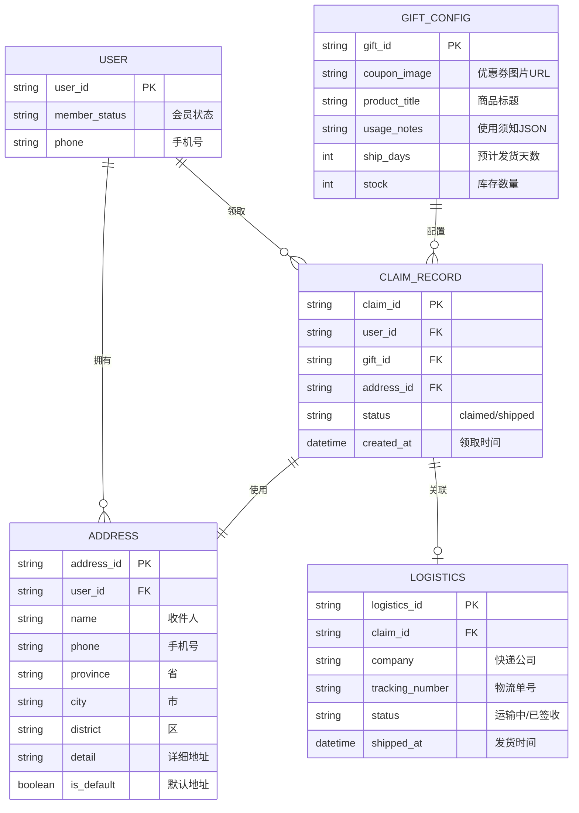
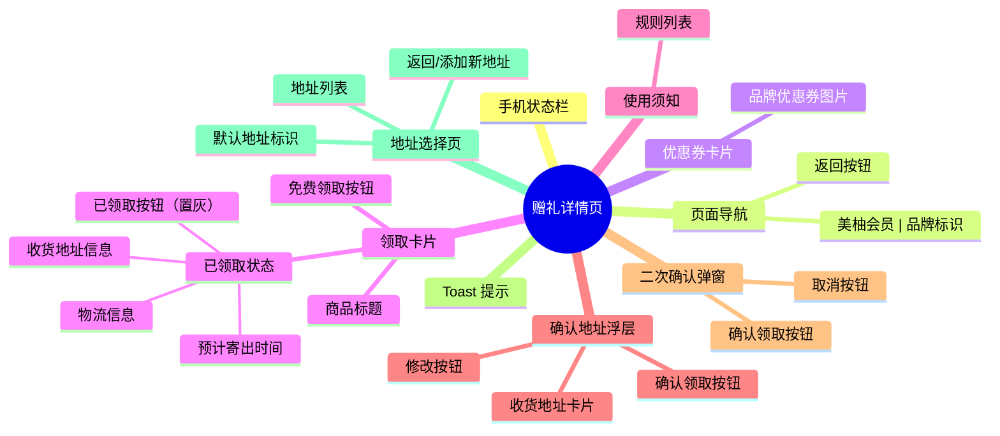
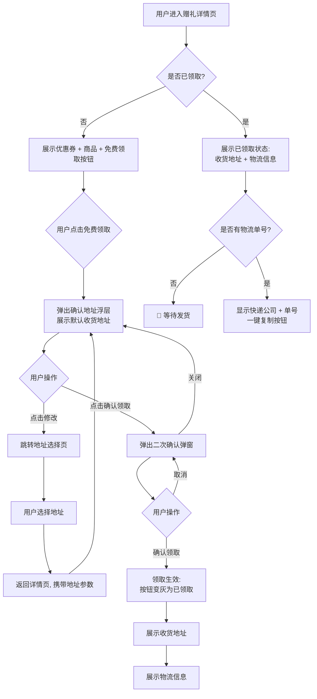

# 运营可以通过赠礼详情页让会员领取品牌联名福利，提升会员活跃与品牌曝光

## 元数据
- 状态：待评审
- 父需求：会员福利体系建设
- 分类：会员
- 业务：会员福利
- 迭代：待定
- 处理人：待定
- 优先级：High
- 需求类型：基础建设
- 需求难度：B 现有能力迭代
- 技术等级：P2
- 预估工时：待评估

---

## 一、需求背景

### 1.1 业务大背景

美柚会员体系正在逐步完善，当前已具备会员开通、权益展示等基础能力。为进一步提升会员价值感和留存率，计划引入**品牌联名赠礼**玩法——美柚与第三方品牌（如心相印）合作，由品牌方提供实物商品，美柚作为会员专属福利发放给用户。此举既能增强会员权益感知，也能为商业化品牌合作开辟新场景。

### 1.2 业务子背景

目前已明确首期合作品牌为"相印"（心相印），赠品为「美柚一心婴儿柔纸巾」。运营侧已完成品牌沟通和赠品选品，需要一套完整的**赠礼领取页**承载从"浏览商品 → 确认地址 → 领取成功 → 物流追踪"的用户全链路。同时，后端需支持运营配置优惠券图、商品信息、使用须知等内容。

### 1.3 现状判断及问题

| 现状 | 问题判断 | 历史需求 | 解决方案 |
| --- | --- | --- | --- |
| 会员页仅有权益列表展示，无实物领取能力 | 会员权益停留在虚拟权益（优惠券、积分），缺乏高感知的实物福利 | 无 | 新建赠礼详情页，承载实物领取全流程 |
| 无收货地址管理能力 | 用户在美柚 App 内没有维护收货地址的路径 | 无 | 新建地址选择页，支持地址列表展示与选择 |
| 无赠礼物流追踪能力 | 用户领取后无法查看发货状态和物流信息 | 无 | 页面内嵌物流模块，支持已发货/未发货双态切换 |
| 品牌联名推广无落地页 | 品牌方需要曝光触点，但美柚内无品牌展示场景 | 无 | 优惠券卡片区域展示品牌视觉素材，支持后台配置 |

---

## 二、项目目标

### 2.1 目标描述

1. **运营可配置**：运营可通过后台配置优惠券图片、商品标题、使用须知文案、发货时效，前端无需发版
2. **用户体验闭环**：用户可在赠礼详情页完成"浏览→领取→查物流"的一站式操作，减少跳转流失
3. **降低人工客服成本**：通过使用须知、物流自助查询、地址不可修改提示等功能，减少客服改址/催发货工单

### 2.2 迭代节奏

| 阶段 | 内容 | 说明 |
| --- | --- | --- |
| Phase 1 | 赠礼详情页 MVP | 优惠券展示 + 商品标题 + 免费领取按钮 + 地址选择 + 确认流程 + 已领取状态 + 物流展示 + 使用须知 |
| Phase 2 | 后台配置能力 | 运营后台配置优惠券图、商品信息、使用须知、发货天数 |
| Phase 3 | 物流自动同步 | 对接快递公司 API，自动获取物流轨迹并在页内展示 |

### 2.3 风险预判

| 风险项 | 级别 | 说明 | 应对策略 |
| --- | --- | --- | --- |
| 地址数据准确性 | 高 | 用户可能填错地址导致发错货 | 二次确认弹窗 + 地址锁定后不可修改 + 客服电话兜底 |
| 库存不足 | 中 | 赠品数量有限，领取超出库存 | "免费领取"按钮置灰 + "已领完"提示 |
| 非会员访问 | 低 | 非会员用户访问本页 | 按钮置灰 + 引导开通会员 |
| 并发领取 | 中 | 高并发下超发 | 后端做幂等校验，一人一单 |

---

## 三、需求方案

### 3.1 名词定义

| 名词 | 定义 |
| --- | --- |
| 赠礼详情页 | 用户领取品牌联名实物福利的落地页（即 `index.html`） |
| 优惠券卡片 | 页面顶部展示品牌优惠券/赠品视觉的区域，由运营在后台配置图片 |
| 领取卡片 | 展示商品标题和"免费领取"按钮的核心操作区 |
| 确认浮层 | 底部弹出的半屏面板，用户在此确认收货地址并触达二次确认 |
| 二次确认弹窗 | 居中模态框，防止用户误操作的最后确认步骤 |
| 地址选择页 | 独立的收货地址列表页（`address.html`），用户选择地址后跳转回详情页 |
| 已领取状态 | 用户确认领取后的页面状态：按钮变灰、展示收货地址、展示物流信息 |
| 物流信息模块 | 展示发货状态和物流单号的区域，支持"等待发货"和"已发货"双态 |

### 3.2 E-R 图

### 3.3 产品结构图

### 3.4 产品流程图

### 3.5 原型图

原型已实现为可交互 HTML 页面：

- **赠礼详情页**：`赠礼详情页/index.html`（含完整交互逻辑、需求说明标注）
- **地址选择页**：`赠礼详情页/address.html`（地址列表 + 选择跳转）

> 可在浏览器中直接打开体验完整领流程。

### 3.6 需求说明

#### 模块一：优惠券卡片

| 功能模块 | 功能点 | 优先级 | 详细说明 |
| --- | --- | --- | --- |
| 优惠券卡片 | 优惠券图片展示 | P0 | 展示品牌合作优惠券图片，由运营在赠礼后台配置并上传。图片原比例显示，带圆角和阴影效果，支持 jpg/png/webp 格式 |
| 优惠券卡片 | 图片配置能力 | P1 | 优惠券图片、图片替代文本（alt）由后台配置下发，前端不做文案编辑，仅渲染 |
| 优惠券卡片 | 点击交互 | P2 | 当前版本为纯展示；后续版本可扩展为跳转品牌活动页或唤起品牌小程序 |

#### 模块二：领取卡片

| 功能模块 | 功能点 | 优先级 | 详细说明 |
| --- | --- | --- | --- |
| 领取卡片 | 商品标题展示 | P0 | 展示赠品名称（如"美柚一心婴儿柔纸巾..."），标题支持多行，由后台配置 |
| 领取卡片 | 免费领取按钮 | P0 | 粉色胶囊按钮，居中展示。未领取用户可点击触发领取流程 |
| 领取卡片 | 已领取状态 | P0 | 确认领取后切换：按钮变灰显示"已领取"，下方展示预计寄出时间（如"预计7个工作日内寄出"） |
| 领取卡片 | 按钮防抖 | P1 | 已领取状态不可逆；未领取状态点击后弹窗交互，防止重复点击 |
| 领取卡片 | 异常状态-已领完 | P1 | 库存不足时按钮置灰显示"已领完"，不可点击 |
| 领取卡片 | 异常状态-非会员 | P2 | 非会员用户按钮置灰 + 引导开通会员提示 |

#### 模块三：收货地址展示

| 功能模块 | 功能点 | 优先级 | 详细说明 |
| --- | --- | --- | --- |
| 收货地址 | 常驻展示 | P0 | 已领取后收货信息常驻展示在领取卡片下方，浅灰底色（#f6f6f8）区分于白色主卡片 |
| 收货地址 | 信息展示规则 | P0 | 收件人姓名完整展示；手机号中间4位脱敏（如 132****5555）；详细地址完整展示省市区+门牌号 |
| 收货地址 | 只读锁定 | P0 | 地址确认后锁定不可编辑，如有误需联系客服人工修改 |
| 收货地址 | 数据来源 | P0 | 数据来源于用户在地址选择页的选择，通过 URL 参数（name/phone/addr）传递回详情页 |

#### 模块四：物流信息

| 功能模块 | 功能点 | 优先级 | 详细说明 |
| --- | --- | --- | --- |
| 物流信息 | 未发货状态 | P0 | 显示"🚚 等待发货"，灰色文字，纯文本无操作 |
| 物流信息 | 已发货状态 | P0 | 显示快递公司名称 + 物流单号 + 粉色"复制"按钮 |
| 物流信息 | 复制单号 | P0 | 点击"复制"按钮一键复制物流单号到剪贴板；成功后按钮变绿色显示"已复制"，2秒后恢复 |
| 物流信息 | 状态切换 | P1 | 运营在后台录入快递公司和单号后，前端刷新即切换为已发货状态 |
| 物流信息 | 物流轨迹追踪 | P2 | 后续对接快递API，在页内直接展示物流轨迹时间线 |

#### 模块五：使用须知

| 功能模块 | 功能点 | 优先级 | 详细说明 |
| --- | --- | --- | --- |
| 使用须知 | 规则列表展示 | P0 | 展示领取条件、发货时效、售后渠道等规则说明，默认5条 |
| 使用须知 | 文案可配置 | P1 | 使用须知文案由后台运营统一配置，支持多条规则自由增删改 |
| 使用须知 | 客服电话 | P1 | 第5条客服电话需配置为实际运营号码，而非占位符 |

#### 模块六：确认地址浮层

| 功能模块 | 功能点 | 优先级 | 详细说明 |
| --- | --- | --- | --- |
| 确认浮层 | 触发逻辑 | P0 | 用户点击"免费领取"即弹出；或从地址选择页返回（URL带参数）时自动弹出 |
| 确认浮层 | 地址展示 | P0 | 底部半屏面板，展示收件人姓名 + 脱敏手机号 + 完整地址 |
| 确认浮层 | 寄出时间提示 | P0 | 展示"预计 X 个工作日内寄出"，X 由后台可配置 |
| 确认浮层 | 修改按钮 | P0 | 点击"修改"关闭弹窗，跳转地址选择页重新选择地址 |
| 确认浮层 | 确认领取按钮 | P0 | 点击后弹出二次确认弹窗，不做直接领取 |
| 确认浮层 | 关闭方式 | P1 | 支持点击遮罩关闭、下滑关闭 |
| 确认浮层 | 防重复弹窗 | P0 | 确认后立即清除 URL 参数（history.replaceState），刷新页面不再弹窗 |
| 确认浮层 | 默认地址 | P1 | 如用户无地址记录则取默认地址，需后台提供"获取用户默认地址"接口 |

#### 模块七：二次确认弹窗

| 功能模块 | 功能点 | 优先级 | 详细说明 |
| --- | --- | --- | --- |
| 二次确认 | 弹出触发 | P0 | 用户在确认地址浮层点击"确认领取"后弹出 |
| 二次确认 | 弹窗内容 | P0 | 居中模态框，⚠️图标 + "确认领取赠礼？"标题 + "领取后收货地址将不可修改"提示 |
| 二次确认 | 取消按钮 | P0 | 点击"取消"关闭二次弹窗，回到确认地址浮层 |
| 二次确认 | 确认领取按钮 | P0 | 点击后：关闭所有弹窗 → 页面切换为已领取状态 → 地址信息锁定 → 展示物流模块 |
| 二次确认 | 关闭方式 | P1 | 支持点击遮罩关闭 |

#### 模块八：地址选择页（独立页面）

| 功能模块 | 功能点 | 优先级 | 详细说明 |
| --- | --- | --- | --- |
| 地址选择 | 地址列表 | P0 | 展示用户所有收货地址，每条显示收件人、手机号、地址详情 |
| 地址选择 | 默认地址标识 | P0 | 默认地址显示"默认"标签（灰色 badge） |
| 地址选择 | 选择跳转 | P0 | 点击地址行跳转回详情页，通过 URL 参数 name/phone/addr 传递选中地址 |
| 地址选择 | 添加新地址 | P1 | "添加新地址"按钮，跳转地址编辑表单 |
| 地址选择 | 返回按钮 | P0 | 点击返回跳回赠礼详情页 |

#### 模块九：需求说明标注系统

| 功能模块 | 功能点 | 优先级 | 详细说明 |
| --- | --- | --- | --- |
| 需求标注 | 标注按钮 | P2 | 每个功能模块右上角有橙色"需求说明"按钮，点击弹出该模块的需求描述弹窗 |
| 需求标注 | 弹窗展示 | P2 | 居中模态框，展示模块的业务背景、用户场景、业务规则、边界情况等说明 |
| 需求标注 | 渲染逻辑 | P2 | 支持纯文本和 HTML 两种内容格式自动识别渲染 |

### 3.7 协同方需求

| 协同方 | 配合内容 | 备注 |
| --- | --- | --- |
| 后端开发 | 提供赠礼详情数据接口（优惠券图、商品标题、使用须知、发货天数）、用户收货地址列表接口、物流信息查询接口、领取/已领取状态查询接口 | 需支持幂等，防止重复领取 |
| 运营 | 配置优惠券图片素材、商品标题文案、使用须知内容、发货天数 | 图片需提供规范尺寸和格式要求 |
| 品牌方（相印） | 提供品牌优惠券视觉素材、品牌标识 | 需授权使用品牌元素 |
| 客服 | 准备地址修改、物流查询等话术模板 | 需在后台系统开通订单查询权限 |
| 会员团队 | 提供会员状态校验接口，确保非会员无法领取 | 需与会员开通流程联动 |
